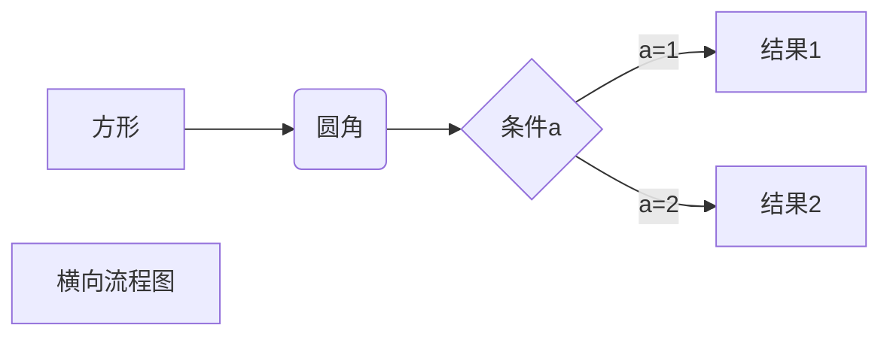

#####   Markdown 高级技巧
###### 支持的 HTML 元素 不在 Markdown 涵盖范围之内的标签，都可以直接在文档里面用 HTML 撰写。
使用 <kbd>Ctrl</kbd>+<kbd>Alt</kbd>+<kbd>Del</kbd> 重启电脑   
<p>在对话窗口输入: <kbd>cmd</kbd><br />然后点击 OK 按钮。</p>  
<p>保存文件请使用快捷键 <kbd>Ctrl</kbd> + <kbd>S</kbd></p>  

######   转义 Markdown 使用了很多特殊符号来表示特定的意义，如果需要显示特定的符号则需要使用转义字符，Markdown 使用反斜杠转义特殊字符：
**文本加粗**  
\*\* 正常显示星号 \*\*  
Markdown 支持以下这些符号前面加上反斜杠来帮助插入普通的符号：  
```
\   反斜线
`   反引号
*   星号
    _   下划线
    {}  花括号
    []  方括号
    ()  小括号
#   井字号
+   加号
-   减号
    .   英文句点
    !   感叹号
```

#####   公式 [特殊软件]
Markdown Preview Enhanced 使用 KaTeX 或者 MathJax 来渲染数学表达式。
$f(x)= sin(x)+12$

###### 流程图 [特殊软件]

